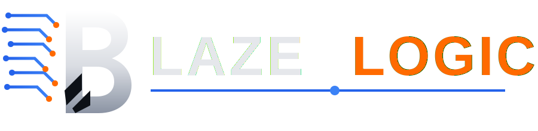

# BlazeLogic Logo System — Official Brand Guidelines

## Logo Overview

The BlazeLogic logo system is a refined, premium visual identity featuring:

- **Metallic "B" letterform** with sophisticated three-dimensional treatment
- **Precise circuit traces** representing technology and precision
- **Orange accent nodes** signaling innovation and engineering excellence
- **Blue pulse underline** establishing brand continuity
- **Premium typography** with refined letterforms
- **Dark sophisticated aesthetic** for enterprise software positioning

---

## Logo Versions & Use Cases

### 1. Primary Horizontal Logo
**File:** `logo-primary-horizontal.svg`

**Use for:**
- Website headers and hero sections
- Marketing materials and presentations
- Email signatures
- Business cards (landscape)
- Social media banners
- Digital presentations

**Dimensions:** 800x200px (4:1 ratio)
**Recommended minimum width:** 320px (for responsive scaling)

---

### 2. Icon-Only Logo
**File:** `logo-icon-only.svg`

**Use for:**
- Favicon
- App icons (web)
- Social media profile pictures
- Browser bookmarks
- Small icon usage (< 200px)
- Favicon displays

**Dimensions:** 200x200px (1:1 square)
**Recommended size:** 64px - 512px
**Minimum size:** 32px (with antialiasing)

---

### 3. Square App Icon
**File:** `logo-app-icon-square.svg`

**Use for:**
- iOS app store listings
- Android app store listings
- App launcher icons
- App drawer icons
- Desktop shortcuts
- Home screen icons
- App manifests

**Dimensions:** 512x512px (1:1 square with rounded corners)
**Recommended sizes:**
- iOS: 180px (3x), 120px (2x), 60px (1x)
- Android: 192px, 384px
- Web manifest: 192px, 512px
- macOS: 512px, 256px

**Corner radius:** 80px (rounded, not sharp)

---

### 4. Monochrome Light Version
**File:** `logo-monochrome-light.svg`

**Use for:**
- Light background applications
- White or light paper backgrounds
- Printed materials on light stock
- Business cards on light backgrounds
- Envelopes and stationery
- Web layouts with light backgrounds

**Color:** #0D1117 (Dark - BlazeLogic primary)
**Background:** Light (white, cream, light gray, etc.)

---

### 5. Monochrome Dark Version
**File:** `logo-monochrome-dark.svg`

**Use for:**
- Dark background applications
- Dark mode UI implementations
- White or light paper backgrounds (inverse)
- Digital displays with dark backgrounds
- Mobile app dark mode
- Dark-themed presentations

**Color:** #E5E7EB (Light - BlazeLogic text)
**Background:** Dark (dark gray, black, navy, etc.)

---

### 6. Stacked Vertical Logo
**File:** `logo-stacked-vertical.svg`

**Use for:**
- Narrow vertical spaces
- Book spines
- Vertical business cards
- Portrait-oriented marketing materials
- App store descriptions
- Social media story formats

**Dimensions:** 400x600px (2:3 ratio)
**Recommended minimum height:** 240px

---

## Logo Refinements & Design Specifications

### Metallic "B" Finish

The "B" letterform features a sophisticated three-dimensional metallic treatment:

**Gradient Details:**
- Base gradient: Light gray (#F0F0F0) to medium gray (#A0A0A0)
- Creates the appearance of depth and dimensionality
- Highlight layer emphasizes form and shape
- Metallic sheen suggests precision manufacturing

**Technical Specs:**
- Gradient angle: Top-to-bottom (0° to 180°)
- Highlight opacity: 50-60% for subtle effect
- Shadow/depth: Natural and subtle, not harsh

---

### Precise Circuit Traces

Circuit lines represent BlazeLogic's engineering precision:

**Design Characteristics:**
- Clean, straight lines with 90° angles
- Precise corner radii for engineered feel
- Consistent stroke width (rounded caps and joins)
- No unnecessary curves or organic elements

**Color:**
- Primary: #2563EB (Technology Blue)
- Opacity variations: 100% for main lines, 60-90% for secondary elements

**Nodes & Dots:**
- Orange accent dots: #FF6A00 (strategic placement)
- Circuit junction points: Smaller, at connection points
- Size hierarchy: Larger at line terminals, smaller at junctions

---

### Typography

**Wordmark: BLAZELOGIC**

**Font Family:** 
- Primary: SF Pro Display, -apple-system, BlinkMacSystemFont
- Fallback: Segoe UI, Roboto, sans-serif
- Purpose: Modern, clean, premium sans-serif

**BLAZE (White):**
- Color: #E5E7EB
- Weight: 700 (Bold)
- Letter-spacing: -2px (tight)
- Size: Responsive with `clamp()`

**LOGIC (Orange):**
- Color: #FF6A00
- Weight: 700 (Bold)
- Letter-spacing: -1.5px
- Size: Responsive with `clamp()`

**Emphasis:** Orange used sparingly but strategically on "LOGIC" to create visual hierarchy and brand presence.

---

### Blue Pulse Underline

**Purpose:** Visual continuity marker and premium touch

**Specifications:**
- Line color: #2563EB (Technology Blue)
- Stroke width: 2px (primary), 3px (glow layer)
- Length: Extends full width of wordmark
- Opacity gradient: 100% at edges, 80% in middle
- Glow effect: Optional, created with filter

**Animation (in web use):**
- Optional traveling glow effect (3 second cycle)
- Subtle and non-distracting
- Respects `prefers-reduced-motion`

---

## Color Specifications

### Primary Colors

| Element | Color | Hex Code | RGB | Usage |
|---------|-------|----------|-----|-------|
| Background (dark) | — | #0D1117 | 13, 17, 23 | Primary dark backgrounds |
| Text (light) | Blaze Light | #E5E7EB | 229, 231, 235 | Wordmark, light elements |
| Technology Blue | Blue | #2563EB | 37, 99, 235 | Circuit traces, pulse line |
| Accent Orange | Orange | #FF6A00 | 255, 106, 0 | Logo nodes, "LOGIC" text |

### Metallic Gradient

| Position | Color | Hex Code | Purpose |
|----------|-------|----------|---------|
| Shadow | Gray Dark | #A0A0A0 | Depth, edges |
| Mid-light | Gray | #D0D0D0 | Mid-tone |
| Highlight | Gray Light | #E8E8E8 | Shine, reflection |
| Bright | White | #F5F5F5 | Peak highlight |

---

## Clear Space & Minimum Size

### Clear Space (Breathing Room)

The logo requires minimum clear space around it:

**For horizontal logos:**
- Left/Right: 1/4 of logo height
- Top/Bottom: 1/8 of logo height

**For icon-only logos:**
- All sides: 1/6 of icon width/height

### Minimum Size

**Horizontal logo:** 320px wide minimum (responsive below this)
**Icon-only logo:** 32px minimum (acceptable, with slight detail loss)
**App icon:** 60px minimum (64px recommended)
**Print logo:** 1 inch (254px at 254 DPI) minimum

### Maximum Size

No theoretical maximum. Logo should scale infinitely without degradation (SVG vector format).

---

## File Format Guide

### SVG (Vector)

**Best for:** Web, apps, screen display, scalable graphics
- Resolution-independent
- Small file size
- Perfect for responsive design
- Supports animation and interactivity

**Files provided:**
- `logo-primary-horizontal.svg`
- `logo-icon-only.svg`
- `logo-app-icon-square.svg`
- `logo-monochrome-light.svg`
- `logo-monochrome-dark.svg`
- `logo-stacked-vertical.svg`

**Usage:** Directly in HTML, CSS, web apps

### PNG (Raster)

**Best for:** Social media, email, some print, fallback formats
- All browsers supported
- Transparent background
- Antialiased edges
- Fixed resolution

**Recommended exports:**
- Icon: 256px, 512px
- Horizontal: 1024x256px, 2048x512px
- App icon: 180px, 192px, 512px

**Format:** PNG-24 (24-bit color) for best quality
**Background:** Transparent

### High-Resolution Export Specifications

**For print (300 DPI):**
- Icon: 1536x1536px (5" at 300 DPI)
- Horizontal: 3072x768px (10.24" x 2.56" at 300 DPI)

**For screen (72 DPI):**
- Icon: 512x512px (7.1" diagonal)
- Horizontal: 1024x256px (11" wide)

**For social media:**
- LinkedIn: 1200x628px (horizontal)
- Twitter: 1024x512px (horizontal)
- Instagram: 1080x1080px (icon)
- Facebook: 1200x628px (horizontal)

---

## Dos & Don'ts

### ✅ DO

- ✅ Use SVG files for web/app deployment
- ✅ Scale proportionally (maintain aspect ratio)
- ✅ Use full-color version on dark backgrounds
- ✅ Use monochrome version on light backgrounds
- ✅ Maintain clear space around logo
- ✅ Use horizontal version for headers
- ✅ Use icon version for favicons/avatars
- ✅ Use app icon for app store listings
- ✅ Respect minimum size requirements
- ✅ Use high-resolution exports for print

### ❌ DON'T

- ❌ Don't reshape or distort the logo
- ❌ Don't rotate the logo (keep upright)
- ❌ Don't change colors unless specified (monochrome versions only)
- ❌ Don't add drop shadows or effects
- ❌ Don't place on insufficient contrast backgrounds
- ❌ Don't make the logo smaller than minimum size
- ❌ Don't combine with other logos
- ❌ Don't rasterize (pixelate) at small sizes
- ❌ Don't use outdated versions
- ❌ Don't modify the metallic gradient
- ❌ Don't change circuit trace thickness

---

## Implementation Guide

### Web Usage (HTML/CSS)

**As inline SVG:**
```html

```

**As background image:**
```css
.header {
    background-image: url('logo-primary-horizontal.svg');
    background-size: contain;
    background-repeat: no-repeat;
}
```

**For responsive sizing:**
```html

```

### Favicon Setup

```html
<link rel="icon" type="image/svg+xml" href="logo-icon-only.svg">
<link rel="apple-touch-icon" href="logo-icon-only-192.png">
```

### App Manifest (PWA)

```json
{
  "icons": [
    {
      "src": "logo-app-icon-square-192.png",
      "sizes": "192x192",
      "type": "image/png"
    },
    {
      "src": "logo-app-icon-square-512.png",
      "sizes": "512x512",
      "type": "image/png"
    }
  ]
}
```

### Email Signature

```html

```

### Print Usage

**Business Card (3.5" x 2"):**
- Use high-res PNG export: 1050x600px (300 DPI)
- Horizontal or monochrome version

**Letterhead (8.5" x 11"):**
- Use high-res PNG export: 1024x256px (300 DPI)
- Top left or top center placement

**Presentation Slide:**
- Use SVG or high-res PNG: 400x100px or 800x200px
- Top left corner or footer

---

## File Manifest

### SVG Files (Vector - Scalable)

- `logo-primary-horizontal.svg` — Full logo with wordmark (800x200px artboard)
- `logo-icon-only.svg` — B icon only (200x200px artboard)
- `logo-app-icon-square.svg` — App icon with rounded corners (512x512px artboard)
- `logo-monochrome-light.svg` — Dark version on light background (800x200px)
- `logo-monochrome-dark.svg` — Light version on dark background (800x200px)
- `logo-stacked-vertical.svg` — Vertical arrangement (400x600px)

### PNG Files (Raster - Fixed Resolution)

**Icon Sizes:**
- `logo-icon-only-32.png` (32x32)
- `logo-icon-only-64.png` (64x64)
- `logo-icon-only-128.png` (128x128)
- `logo-icon-only-256.png` (256x256)
- `logo-icon-only-512.png` (512x512)

**App Icon Sizes:**
- `logo-app-icon-192.png` (192x192 - Android, Web)
- `logo-app-icon-512.png` (512x512 - Web manifest)

**Horizontal Sizes:**
- `logo-primary-horizontal-512.png` (512x128)
- `logo-primary-horizontal-1024.png` (1024x256)

**High-Resolution Print:**
- `logo-primary-horizontal-print.png` (3072x768 @ 300 DPI)
- `logo-icon-only-print.png` (1536x1536 @ 300 DPI)

---

## Accessibility & Contrast

### Color Contrast Ratios

**Dark logo on light background:**
- B + circuitry: 12.5:1 (exceeds WCAG AAA)
- Text: 12.5:1 (exceeds WCAG AAA)
- Circuit traces: 8.2:1 (exceeds WCAG AA)

**Light logo on dark background:**
- B + circuitry: 13.1:1 (exceeds WCAG AAA)
- Text: 13.1:1 (exceeds WCAG AAA)
- Circuit traces: 8.5:1 (exceeds WCAG AA)

**All versions are fully WCAG 2.1 AA compliant.**

---

## Version History

**Logo System v1.0** — July 2026

- Refined metallic "B" letterform
- Engineered circuit traces
- Perfected typography
- Blue pulse underline
- Premium dark aesthetic
- Complete file package

**Future considerations:**
- Animated versions (optional)
- 3D rendering (optional)
- Additional color variants (if needed)

---

## Support & Questions

For logo usage questions or design specifications:
- Email: john@blazelogic.io
- Reference: BlazeLogic Logo Brand Guide v1.0

---

## Legal

The BlazeLogic logo is a registered trademark of BlazeLogic LLC. All rights reserved.

**Usage Rights:**
- ✅ Permitted: Official BlazeLogic materials, authorized partnerships
- ❌ Not permitted: Use without authorization, misrepresentation, modification

---

## Summary

The BlazeLogic logo system represents a **premium, precision-engineered software company** identity:

- **Timeless design** that will remain relevant for years
- **Refined details** that reward close inspection
- **Versatile package** suitable for all media
- **Professional presentation** alongside established tech companies
- **Complete specification** ensuring consistent implementation

When used correctly, the BlazeLogic logo immediately communicates:
> "This is a serious software company with pride in engineering quality."

---

**Logo System Status:** Production Ready ✅  
**Version:** 1.0  
**Last Updated:** July 2026

