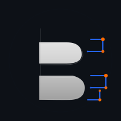
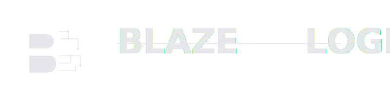
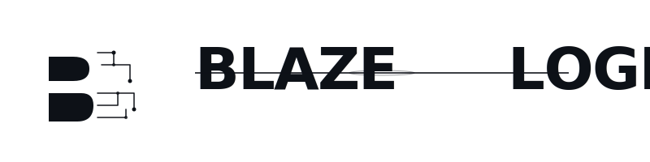

# BlazeLogic Logo — Usage Examples & Applications

## Real-World Implementation Scenarios

This document shows recommended implementations for common use cases.

---

## 1. Website Header

### Primary Header (Hero Section)

**Recommended:** `logo-primary-horizontal.svg`
**Size:** 400-600px wide (responsive, max-width 800px)
**Background:** Dark (#0D1117)
**Placement:** Top-left corner, centered, or hero center
**Spacing:** Minimum 40px from edges

```html
<header>
    <div class="header-logo">
        
    </div>
</header>
```

### Navbar Logo

**Recommended:** `logo-icon-only.svg`
**Size:** 48-64px
**Background:** Dark with blur effect
**Placement:** Left side of navbar
**Spacing:** 16px from edges

```html
<nav class="navbar">
    
</nav>
```

```css
.navbar-logo {
    width: 50px;
    height: 50px;
    transition: transform 0.3s ease;
}

.navbar-logo:hover {
    transform: scale(1.05);
}
```

---

## 2. Mobile App Implementation

### App Store Listings

**iOS App Store:**
- Icon: `logo-app-icon-square-180.png` (3x - 180x180px)
- Also provide 120x120px (2x) and 60x60px (1x)
- Format: PNG-24 with transparency
- No rounded corners in image (iOS does this automatically)
- Appearance: Crisp, professional, recognizable at small sizes

**Android Play Store:**
- Icon: `logo-app-icon-square-192.png` (xhdpi - 192x192px)
- Also provide mdpi (96px), hdpi (144px), xxhdpi (288px), xxxhdpi (384px)
- Format: PNG-24 with transparency
- Corner radius: Built into image (80px radius for 512px)
- Appearance: Consistent, professional, recognizable

### App Manifest Configuration

```json
{
  "name": "BlazeLogic",
  "short_name": "BlazeLogic",
  "description": "Professional software for serious developers",
  "start_url": "/",
  "display": "standalone",
  "background_color": "#0D1117",
  "theme_color": "#2563EB",
  "icons": [
    {
      "src": "logo-app-icon-192.png",
      "sizes": "192x192",
      "type": "image/png",
      "purpose": "any"
    },
    {
      "src": "logo-app-icon-512.png",
      "sizes": "512x512",
      "type": "image/png",
      "purpose": "any maskable"
    }
  ]
}
```

### iOS Configuration (Info.plist)

```xml
<dict>
    <key>CFBundleIcons</key>
    <dict>
        <key>CFBundlePrimaryIcon</key>
        <dict>
            <key>CFBundleIconFiles</key>
            <array>
                <string>logo-app-icon-180</string>
                <string>logo-app-icon-120</string>
                <string>logo-app-icon-60</string>
            </array>
        </dict>
    </dict>
</dict>
```

---

## 3. Website Favicon

### Favicon Setup

```html
<!-- SVG favicon (modern, recommended) -->
<link rel="icon" type="image/svg+xml" href="logo-icon-only.svg">

<!-- PNG fallback for older browsers -->
<link rel="icon" type="image/png" sizes="192x192" href="logo-icon-only-192.png">
<link rel="icon" type="image/png" sizes="32x32" href="logo-icon-only-32.png">

<!-- Apple touch icon -->
<link rel="apple-touch-icon" href="logo-icon-only-180.png">

<!-- Windows tile (optional) -->
<meta name="msapplication-TileImage" content="logo-icon-only-144.png">
<meta name="msapplication-TileColor" content="#0D1117">
```

### Favicon in Root Directory

Place these files in your website root (`/`):
- `favicon.ico` (classic, 32x32px)
- `favicon.svg` (SVG version)
- `apple-touch-icon.png` (180x180px)
- `logo-icon-only-192.png` (192x192px)
- `logo-icon-only-512.png` (512x512px)

---

## 4. Email Signature

### Professional Email Template

```html
<table style="font-family: -apple-system, BlinkMacSystemFont, 'Segoe UI', sans-serif; width: 100%; max-width: 500px;">
    <tr>
        <td style="padding: 20px 0; border-top: 1px solid #30363D;">
            
            <p style="margin: 0 0 8px; font-size: 14px; color: #E5E7EB;">
                <strong>John Doe</strong><br>
                <span style="color: #64748B;">Founder & CEO</span>
            </p>
            <p style="margin: 0; font-size: 13px; color: #64748B;">
                john@blazelogic.io<br>
                <a href="https://blazelogic.io" style="color: #2563EB; text-decoration: none;">blazelogic.io</a>
            </p>
        </td>
    </tr>
</table>
```

### Dark Background Email

For dark background emails, use `logo-monochrome-dark.svg` instead.

---

## 5. Business Card Design

### Standard Business Card (3.5" x 2" at 300 DPI)

**Dimensions:** 1050px x 600px

**Layout Option 1: Logo Left**
```
|[Logo Icon] BlazeLogic LLC                |
|             John Doe                     |
|             john@blazelogic.io           |
|             blazelogic.io                |
```

**Layout Option 2: Logo Top**
```
|      [BlazeLogic Logo Horizontal]        |
|                                          |
|  John Doe | john@blazelogic.io          |
|  blazelogic.io                          |
```

**Design Specifications:**
- Logo size: 300x75px (horizontal) or 80x80px (icon)
- Background: White or light gray
- Use `logo-monochrome-light.svg`
- Font: SF Pro Display or system font
- Text color: #0D1117
- Accent color: #2563EB or #FF6A00 (sparingly)
- Print resolution: 300 DPI
- File format: PDF or high-res PNG

---

## 6. Presentation Slide

### PowerPoint/Keynote

**Slide Template Header:**
```
┌──────────────────────────────────┐
│ [Logo Icon] BlazeLogic           │ ← 60x60px icon
│                                  │
├──────────────────────────────────┤
│                                  │
│   Presentation Title             │
│   Subtitle                       │
│                                  │
└──────────────────────────────────┘
```

**Specifications:**
- Logo size: 60x60px (icon) or 300x75px (full logo)
- Placement: Top-left or top-center
- Background: Dark slide (#1a1a1a or darker)
- Use full-color logo or monochrome-dark
- Ensure adequate contrast
- No text overlay on logo

### Title Slide

```
┌─────────────────────────────────────┐
│                                     │
│      [Full Logo Centered]           │
│                                     │
│                                     │
│         Presentation Title          │
│         Date | Presenter Name       │
│                                     │
└─────────────────────────────────────┘
```

---

## 7. Social Media Profiles

### Twitter/X Header

**Dimensions:** 1024x512px
**Recommended:** `logo-primary-horizontal-twitter.png`
**Safe area:** Avoid placing important content in bottom 60px

**Design:**
```
[Dark background with subtle gradient]
[BlazeLogic horizontal logo centered]
```

### LinkedIn Banner

**Dimensions:** 1200x628px
**Recommended:** `logo-primary-horizontal-linkedin.png`
**Safe area:** Center 800x400px area

**Design:**
```
[Dark background]
[Logo on left or center]
[Tagline or company description on right]
```

### Instagram Profile Picture

**Dimensions:** 1080x1080px
**Recommended:** `logo-icon-only-512.png` (with padding)
**Safe area:** Center 600x600px

**Design:**
```
[Logo icon centered with 20% padding]
[Dark background]
```

### Facebook Profile Picture

**Dimensions:** 170x170px (minimum)
**Recommended:** `logo-icon-only-256.png` (resized)
**Safe area:** Center 170x170px

---

## 8. Marketing Collateral

### Printed Poster

**Sizes:**
- Small: 11x8.5" (2640x2040px @ 240 DPI)
- Standard: 24x36" (5760x8640px @ 240 DPI)
- Large: 36x48" (8640x11520px @ 240 DPI)

**Logo Placement:**
- Top-left corner: 2-4" horizontal size
- Bottom-right corner: 1.5-2" horizontal size
- Center (with other elements): 4-6" horizontal size

**File:** `logo-primary-horizontal-print-3072.png` (300 DPI)

### Printed Brochure

**Logo Placement:**
- Front cover: 3-4" horizontal, top-left or top-center
- Back cover: 1-2" horizontal, bottom-right
- Inside pages: 1.5" horizontal, top-left

**File:** `logo-primary-horizontal.svg` or PNG at 300 DPI

### Trade Show Banner

**Dimensions:** 10' x 6' (3000px x 1800px @ 300 DPI)

**Logo Placement:**
- Top-center: 24-30" horizontal size
- Bottom-left/right: 12-18" horizontal size

**File:** `logo-primary-horizontal-print-3072.png`

---

## 9. LinkedIn Article Header

**Dimensions:** 1200x628px
**Recommended:** `logo-primary-horizontal-linkedin.png`

```html

```

---

## 10. GitHub Organization

### GitHub Organization Logo

**Size:** 512x512px
**Recommended:** `logo-app-icon-square-512.png`
**Format:** PNG with transparent background
**Appearance:** Square, recognizable at small sizes

**GitHub Settings:**
1. Organization → Settings → Profile photo
2. Upload: `logo-app-icon-square-512.png`
3. Crop to fit square
4. Ensure visibility at all sizes

---

## 11. Documentation Header

### Markdown Documentation

```markdown


# API Documentation
...
```

### HTML Documentation

```html
<header class="docs-header">
    
    <h1>BlazeLogic API Reference</h1>
</header>
```

---

## 12. Loading Screen / Splash Screen

### Mobile App Splash

**Dimensions:** 
- iOS: 1242x2688px (iPhone 12 Pro Max)
- Android: 1080x1920px

**Logo Size:** 400-600px
**Animation:** Fade in over 1-2 seconds
**File:** `logo-primary-horizontal.svg` or `logo-app-icon-square.svg`

```html
<div class="splash-screen">
    
    <p class="splash-text">BlazeLogic</p>
</div>
```

---

## 13. Dark Mode Implementations

### Dark Mode Toggle

**Dark backgrounds:** Use `logo-monochrome-dark.svg`
```html

```

**Light backgrounds:** Use `logo-monochrome-light.svg`
```html

```

**Automatic toggle with CSS:**
```css
@media (prefers-color-scheme: dark) {
    .logo-src {
        content: url('logo-monochrome-dark.svg');
    }
}

@media (prefers-color-scheme: light) {
    .logo-src {
        content: url('logo-monochrome-light.svg');
    }
}
```

---

## 14. Print-Ready PDF

### Creating Print-Ready PDFs

**Resolution:** 300 DPI minimum
**Color space:** CMYK (for professional printing)
**File:** PDF with embedded fonts
**Logo export:** Use `logo-primary-horizontal-print-3072.png`

**Best practice:**
1. Design in Adobe InDesign or Figma
2. Export with print profile: CMYK
3. Embed all fonts
4. Set resolution to 300 DPI
5. Send to printer as PDF/X-1a

---

## Quick Reference Table

| Use Case | Recommended File | Size | Format |
|----------|------------------|------|--------|
| Website header | logo-primary-horizontal.svg | 400-800px | SVG |
| Navbar | logo-icon-only.svg | 48-64px | SVG |
| Favicon | logo-icon-only.svg | 32-512px | SVG/PNG |
| App icon | logo-app-icon-square.svg | 192-512px | PNG |
| Email signature | logo-primary-horizontal.svg | 300-600px | PNG |
| Business card | logo-primary-horizontal.svg | 1050x600px | PNG (300 DPI) |
| Presentation | logo-primary-horizontal.svg | 60-300px | SVG/PNG |
| Social media | logo-primary-horizontal.svg | 512-2048px | PNG |
| Print poster | logo-primary-horizontal-print | 1200-4800px | PNG (300 DPI) |
| Documentation | logo-icon-only.svg | 128-512px | SVG |

---

## General Best Practices

✅ **DO:**
- Use SVG for web and screen
- Use PNG for print and email
- Maintain aspect ratio when scaling
- Use high-DPI exports for print
- Respect minimum size requirements
- Use monochrome versions when needed
- Provide alt text for accessibility

❌ **DON'T:**
- Distort or reshape the logo
- Add shadows or effects
- Place on low-contrast backgrounds
- Use low-resolution exports
- Change colors without permission
- Make it smaller than minimum size

---

## Support

Questions about logo usage or implementation?

- Email: john@blazelogic.io
- Reference: BlazeLogic Logo Brand Guide
- Version: 1.0

---

**Last Updated:** July 2026  
**Status:** Production Ready ✅

